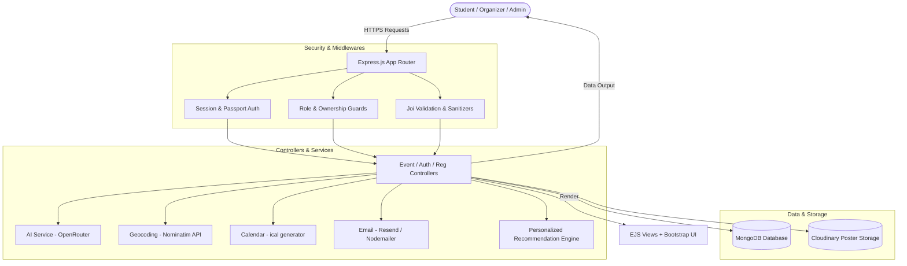

<div align="center">

# 🎓 College Event Hub

### *An Intelligent, AI-Powered Campus Event Management & Discovery Platform*

Empowering students to discover, register, and experience campus life while providing organizers and administrators with intelligent event orchestration, automated waitlists, and deep analytics.

---

[](https://nodejs.org/)
[](https://expressjs.com/)
[](https://www.mongodb.com/)
[](https://getbootstrap.com/)
[](https://openrouter.ai/)
[](https://cloudinary.com/)
[](LICENSE)

[Features](#-key-features) • [Architecture](#-system-architecture) • [Getting Started](#-getting-started) • [Demo Accounts](#-pre-seeded-demo-accounts) • [API Routes](#-api-endpoints--route-reference) • [Environment Config](#-environment-variables)

</div>

---

## 📖 Table of Contents

- [Overview](#-overview)
- [Key Features](#-key-features)
  - [🎓 Student Experience](#-student-experience)
  - [🎪 Organizer Operations](#-organizer-operations)
  - [🧠 AI-Powered Intelligence](#-ai-powered-intelligence)
  - [🎟️ Smart Registration & Auto-Waitlist](#️-smart-registration--auto-waitlist)
  - [📬 Notification & Calendar Suite](#-notification--calendar-suite)
  - [🛡️ Security & Role-Based Access Control](#️-security--role-based-access-control)
- [System Architecture](#-system-architecture)
  - [High-Level Flow](#high-level-flow)
  - [Recommendation Scoring Formula](#recommendation-scoring-formula)
- [Tech Stack](#-tech-stack)
- [Project Directory Structure](#-project-directory-structure)
- [Getting Started](#-getting-started)
  - [Prerequisites](#prerequisites)
  - [Installation](#installation)
  - [Configuration (.env)](#configuration-env)
  - [Database Seeding](#database-seeding)
  - [Running the Application](#running-the-application)
- [Pre-Seeded Demo Accounts](#-pre-seeded-demo-accounts)
- [API Endpoints & Route Reference](#-api-endpoints--route-reference)
- [Environment Variables](#-environment-variables)
- [Deployment Guide](#-deployment-guide)
- [Contributing](#-contributing)
- [Author & Acknowledgments](#-author--acknowledgments)

---

## 🌟 Overview

**College Event Hub** is a production-grade, full-stack web application designed to solve the chaos of fragmented campus communications. From college fests and competitive hackathons to academic seminars and sports meets, EventHub centralizes the entire lifecycle of collegiate events into a unified, responsive portal.

### Why College Event Hub?
- **Unified Discovery**: Eliminates missed opportunities caused by scattered flyers, WhatsApp groups, and siloed club notices.
- **AI Acceleration**: Streamlines event posting with automatic markdown description drafting, intelligent category suggestion, and consolidated feedback summarization.
- **Fair Capacity Handling**: Prevents overbooking with an automated FIFO waitlist that auto-promotes standby students the instant a seat frees up.
- **Zero-Friction Calendering**: One-tap calendar synchronizations (`.ics` downloads + Google Calendar direct links) and interactive venue geocoding.

---

## ✨ Key Features

### 🎓 Student Experience
- **Interactive Event Exploration**: Filter events by category (`Workshop`, `Hackathon`, `Seminar`, `Cultural`, `Sports`), timeline (Upcoming, This Week, This Month), pricing (Free vs. Paid), and registration status.
- **Full-Text Keyword Search**: Query events by title, venue, organizer, or summary keywords.
- **Wishlist & Bookmarks**: Save events to your personal wishlist with instant toggle updates.
- **Simulated Payment Gateway**: Polished interactive checkout modal simulating credit card payments for paid campus events.
- **Attendee Reviews & Star Ratings**: Submit post-attendance ratings (1-5 stars) and detailed reviews once an event concludes.
- **Student Dashboard**: Track active tickets, past attendance records, and waitlisted positions in one place.

### 🎪 Organizer Operations
- **Event Lifecycle Studio**: Create, edit, publish, reschedule, or cancel events with custom posters, dates, venues, capacities, and pricing.
- **Attendee Management & Check-In**: View registered students, toggle attendance status in real time, and monitor live seat occupancy.
- **Spreadsheet Export**: Export attendee lists directly to formatted Excel (`.xlsx`) files using SheetJS.
- **Organizer Analytics**: Real-time stats on total registrations, revenue, waitlist counts, and average attendee ratings.

### 🧠 AI-Powered Intelligence
Powered by OpenRouter LLMs (with zero-crash offline simulation fallbacks):
- **AI Event Description Generator**: Turns rough bullet points and titles into formatted Markdown copy with sections for overview, highlights, and target audience.
- **Smart Categorizer**: Parses event context to recommend ideal tags and categories matching system schemas.
- **AI Review Summarizer**: Consolidates dozens of attendee reviews into structured reports highlighting strengths, sentiment, and areas for improvement.
- **Personalized Recommendation Engine**: Custom multi-factor scoring algorithm tailored to each student's profile.

### 🎟️ Smart Registration & Auto-Waitlist
- **Atomic Capacity Checks**: Enforces hard event capacity limits to prevent overselling.
- **Automatic Waitlisting**: When an event hits 100% capacity, additional registrations transition to `waitlisted` status.
- **Instant Auto-Promotion**: If a registered attendee cancels their ticket, the system automatically promotes the earliest waitlisted student, updates their status to `registered`, and sends a confirmation email.

### 📬 Notification & Calendar Suite
- **Email Notification Engine**: Automated emails sent via Nodemailer (supporting Resend API, SMTP/Mailtrap, or an integrated developer console simulation mode).
  - Registration confirmations
  - Waitlist alerts & automatic seat promotion notices
  - Event schedule changes & organizer announcements
  - Post-event feedback requests
  - Secure time-limited password reset tokens (1-hour expiry)
- **Calendar Integrations**:
  - Download standard `.ics` invitation files (Apple Calendar, Microsoft Outlook, Thunderbird).
  - Direct single-click "Add to Google Calendar" link generation.
- **Interactive Venue Maps**: OpenStreetMap geocoding via the Nominatim API with responsive Leaflet / Mapbox map rendering.

### 🛡️ Security & Role-Based Access Control
- **Authentication**: Passport.js local strategy with secure salted password hashing (`passport-local-mongoose`) and optional Google OAuth 2.0 integration.
- **Three-Tier RBAC**: Granular permissions distinguishing `student`, `organizer`, and `admin` roles.
- **Defensive Middleware**:
  - `express-mongo-sanitize` for NoSQL injection prevention.
  - `helmet` security headers.
  - `joi` schema validation for incoming event, registration, and review payloads.
  - HTTP-only signed session cookies with 7-day lifespans.

---

## 🏗️ System Architecture

### High-Level Flow



### Recommendation Scoring Formula

The recommendation engine dynamically computes an affinity score for each upcoming event:

$$\text{Score} = \text{Interest Match (5 pts)} + (\text{Past Category Attendance} \times 2) + \text{Wishlist Match (10 pts)} + \min(\text{Registrations} \times 0.2, 10) + (\text{Tag Overlaps} \times 1.5)$$

---

## 🛠️ Tech Stack

| Category | Technology | Description |
|---|---|---|
| **Runtime Environment** | [Node.js](https://nodejs.org/) (>= 24.0.0) | High-performance V8 JavaScript runtime |
| **Backend Framework** | [Express.js](https://expressjs.com/) (v4.21) | Robust web application framework |
| **Database & ODM** | [MongoDB](https://www.mongodb.com/) / [Mongoose](https://mongoosejs.com/) (v8.8) | Document database with schema modeling |
| **Templating Engine** | [EJS](https://ejs.co/) & [ejs-mate](https://github.com/JacksonTian/ejs-mate) | Layout-enabled dynamic server-side rendering |
| **Styling & UI** | [Bootstrap 5](https://getbootstrap.com/) + Custom CSS | Responsive layout, modern components, dark accents |
| **Authentication** | [Passport.js](http://www.passportjs.org/) | Local username/password & Google OAuth 2.0 |
| **AI Integration** | [OpenRouter](https://openrouter.ai/) | Multi-model routing (Gemini, Llama, Gemma) |
| **Asset Storage** | [Cloudinary](https://cloudinary.com/) + [Multer](https://github.com/expressjs/multer) | Cloud media storage with automatic fallbacks |
| **Mapping & Geocoding** | [Leaflet.js](https://leafletjs.com/) + [Nominatim](https://nominatim.org/) | Open-source map markers and address geocoding |
| **Email Service** | [Nodemailer](https://nodemailer.com/) / [Resend](https://resend.com/) | Transactional HTML email delivery |
| **Calendar Sync** | [ical-generator](https://github.com/sebbo2002/ical-generator) | RFC 5545 iCalendar (`.ics`) file generation |
| **Data Export** | [SheetJS (xlsx)](https://sheetjs.com/) | Server-side Excel workbook generation |
| **Input Validation** | [Joi](https://joi.dev/) | Strict request body schema enforcement |
| **Security** | [Helmet](https://helmetjs.github.io/) & [express-mongo-sanitize](https://github.com/fiznool/express-mongo-sanitize) | Security headers & NoSQL injection sanitization |

---

## 📂 Project Directory Structure

```text
EventHub/
├── controllers/                  # Route handlers & business controllers
│   ├── auth.js                   # Authentication, registration, password resets
│   ├── dashboard.js              # Student & organizer dashboards, analytics, XLSX export
│   ├── events.js                 # Event CRUD, AI triggers, calendar downloads, wishlist
│   ├── registrations.js          # Registrations, waitlist auto-promotion, checkout
│   └── reviews.js                # Reviews and ratings submission & deletion
├── middleware/                   # Express custom middleware
│   ├── auth.js                   # Authentication and role guards (isLoggedIn, hasRole)
│   ├── errorHandler.js           # Centralized application error handler
│   ├── multer.js                 # File upload configuration with Cloudinary & disk storage
│   └── validation.js             # Joi schemas for events, users, and reviews
├── models/                       # Mongoose Data Models
│   ├── Event.js                  # Event metadata, capacity, pricing, coordinates
│   ├── Registration.js           # Enrollment status (registered/waitlisted/attended)
│   ├── Review.js                 # 1-5 star ratings and attendee feedback
│   └── User.js                   # Profile, role, interests, wishlist, OAuth tokens
├── public/                       # Static public assets
│   ├── css/                      # Custom stylesheets
│   ├── js/                       # Client-side scripts (Leaflet maps, interactive UI)
│   └── images/                   # Fallback poster graphics and branding
├── routes/                       # Express routing modules
│   ├── auth.js                   # /register, /login, /logout, /profile, /auth/google
│   ├── dashboard.js              # /dashboard, /dashboard/events/:id/registrations
│   ├── events.js                 # /events (CRUD, AI generation, .ics download)
│   ├── registrations.js          # /events/:id/register, /checkout, /attendance
│   └── reviews.js                # /events/:id/reviews
├── services/                     # External integration layer
│   ├── ai/                       # OpenRouter LLM handlers (descriptions, categorization, reviews)
│   ├── calendar/                 # iCalendar (.ics) and Google Calendar link builders
│   ├── email/                    # HTML email notification templates & transport
│   ├── map/                      # Nominatim OpenStreetMap geocoding
│   └── recommendation/           # Multi-factor event scoring algorithm
├── utils/                        # Utilities & seed scripts
│   ├── catchAsync.js             # Async wrapper for clean error propagation
│   └── seed.js                   # Comprehensive mock database seeder
├── views/                        # EJS dynamic UI templates
│   ├── layouts/                  # Boilerplate master layouts (boilerplate.ejs)
│   ├── partials/                 # Reusable navbars, flash alerts, and footers
│   ├── auth/                     # Authentication & onboarding views
│   ├── dashboard/                # Role-specific dashboard views
│   └── events/                   # Event catalog, detail pages, forms, checkout
├── .env.example                  # Environment configuration template
├── app.js                        # Express server entry point
├── package.json                  # Dependencies and execution scripts
└── README.md                     # Project documentation
```

---

## 🚀 Getting Started

Follow the instructions below to get a local development instance of College Event Hub up and running.

### Prerequisites

Ensure you have the following installed on your machine:
- **Node.js** (v24.0.0 or higher recommended)
- **npm** (v10.0.0 or higher)
- **MongoDB** (v6.0 or higher running locally on port `27017` or a [MongoDB Atlas](https://www.mongodb.com/atlas) connection URI)

### Installation

1. **Clone the repository**:
   ```bash
   git clone https://github.com/BalakaLaluthVardhan/EventHub.git
   cd EventHub
   ```

2. **Install project dependencies**:
   ```bash
   npm install --legacy-peer-deps
   ```

### Configuration (.env)

Create a `.env` file in the root of your project:
```bash
cp .env.example .env
```

Open `.env` and fill in your configurations:
```env
# Server Configuration
PORT=3000
MONGODB_URI=mongodb://127.0.0.1:27017/college-event-hub
SESSION_SECRET=your_super_secret_session_key_here

# Optional: Google OAuth 2.0 (Falls back to development mock login if omitted)
GOOGLE_CLIENT_ID=your_google_client_id_here
GOOGLE_CLIENT_SECRET=your_google_client_secret_here

# Optional: AI Service (OpenRouter - Falls back to realistic offline mock simulation if omitted)
OPENROUTER_API_KEY=your_openrouter_api_key_here
OPENROUTER_MODEL=openrouter/free

# Optional: Cloudinary Storage (Falls back to local disk storage if omitted)
CLOUDINARY_CLOUD_NAME=your_cloudinary_cloud_name
CLOUDINARY_KEY=your_cloudinary_key
CLOUDINARY_SECRET=your_cloudinary_secret

# Optional: Email Service (Falls back to terminal console logger if omitted)
SMTP_HOST=smtp.mailtrap.io
SMTP_PORT=2525
SMTP_USER=your_smtp_username
SMTP_PASS=your_smtp_password
FROM_EMAIL=noreply@collegeeventhub.edu
```

> [!TIP]
> **Zero Setup Headaches**: EventHub is built with resilient fallback defaults! If you don't have OpenRouter, Cloudinary, or SMTP keys ready, the application automatically activates built-in simulations for AI copywriting, local file uploads, and console email logging.

### Database Seeding

Populate your database with rich sample data (1 Admin, 5 Faculty Organizers, 20 Students, 30 Events across all categories, registrations, waitlists, and reviews):

```bash
npm run seed
```

### Running the Application

- **Development Mode** (with automatic file-watching reload):
  ```bash
  npm run dev
  ```

- **Standard Production Start**:
  ```bash
  npm start
  ```

Once started, navigate to `http://localhost:3000` in your web browser.

---

## 👥 Pre-Seeded Demo Accounts

The database seed script (`npm run seed`) provisions pre-configured accounts with populated data ready for instant testing:

| Role | Email Address | Password | Profile & Permissions |
|---|---|---|---|
| **Admin** | `admin@college.edu` | `admin123` | Full administrative control, organizer privileges, event oversight |
| **Organizer** | `rajesh.organizer@college.edu` | `password` | Faculty host, can create/edit events, track check-ins & export XLSX |
| **Organizer** | `priya.organizer@college.edu` | `password` | GDSC Lead host, organizes Hackathons & Cultural fests |
| **Student** | `aarav.sharma@college.edu` | `password` | Pre-registered for upcoming workshops, can review past events |
| **Student** | `ananya.rao@college.edu` | `password` | Active student account with populated interests and wishlist |

---

## 🔌 API Endpoints & Route Reference

### 🔐 Authentication Routes (`/`)

| Method | Endpoint | Access | Description |
|---|---|---|---|
| `GET` | `/register` | Public | Render user registration page |
| `POST` | `/register` | Public | Register new account with validation |
| `GET` | `/login` | Public | Render user login page |
| `POST` | `/login` | Public | Authenticate user session with Passport |
| `GET` | `/logout` | Authenticated | Destroy user session and redirect |
| `GET` | `/profile` | Authenticated | View user profile, interests, and wishlist |
| `POST` | `/profile` | Authenticated | Update user profile and category interests |
| `GET` | `/auth/google` | Public | Initiate Google OAuth 2.0 login |
| `GET` | `/auth/google/callback` | Public | OAuth callback receiver |
| `GET` | `/forgot-password` | Public | Render password reset request form |
| `POST` | `/forgot-password` | Public | Send password reset token email |
| `GET` | `/reset-password/:token` | Public | Render new password entry form |
| `POST` | `/reset-password/:token` | Public | Reset password with token validation |

### 📅 Event Routes (`/events`)

| Method | Endpoint | Access | Description |
|---|---|---|---|
| `GET` | `/events` | Public | Catalog view with search, filter, and sort |
| `GET` | `/events/new` | Organizer / Admin | Form to create a new event |
| `POST` | `/events` | Organizer / Admin | Create event with poster upload & geocoding |
| `GET` | `/events/:id` | Public | Detailed view with map, organizer info, and reviews |
| `GET` | `/events/:id/edit` | Organizer / Admin | Edit form for existing event |
| `PUT` | `/events/:id` | Event Host / Admin | Update event details & venue coordinates |
| `DELETE` | `/events/:id` | Event Host / Admin | Remove event and associated registrations |
| `POST` | `/events/:id/wishlist` | Authenticated | Toggle event in/out of user's wishlist |
| `GET` | `/events/:id/ics` | Public | Download `.ics` iCalendar file for event |
| `POST` | `/events/ai/generate-description` | Organizer / Admin | AI endpoint to draft structured Markdown descriptions |
| `POST` | `/events/ai/suggest` | Organizer / Admin | AI endpoint to suggest categories and tags |
| `POST` | `/events/:id/summarize` | Event Host / Admin | AI endpoint to generate consolidated review summary |

### 🎟️ Registrations & Attendance (`/`)

| Method | Endpoint | Access | Description |
|---|---|---|---|
| `POST` | `/events/:eventId/register` | Authenticated | Register for event (or place on waitlist if full) |
| `POST` | `/events/:eventId/cancel` | Authenticated | Cancel registration & trigger auto-promotion |
| `GET` | `/events/:eventId/checkout` | Authenticated | Render simulated checkout page for paid events |
| `POST` | `/events/:eventId/checkout` | Authenticated | Process simulated payment and confirm ticket |
| `POST` | `/events/attendance/:regId` | Organizer / Admin | Toggle attendee presence / check-in status |

### 📊 Dashboard & Reporting (`/dashboard`)

| Method | Endpoint | Access | Description |
|---|---|---|---|
| `GET` | `/dashboard` | Authenticated | Role-aware dashboard (Student or Organizer overview) |
| `GET` | `/dashboard/events/:id/registrations` | Organizer / Admin | View attendee roster and check-in interface |
| `GET` | `/dashboard/events/:id/export` | Organizer / Admin | Export event attendee roster to Excel (`.xlsx`) |

### ⭐ Reviews & Ratings (`/events/:eventId/reviews`)

| Method | Endpoint | Access | Description |
|---|---|---|---|
| `POST` | `/events/:eventId/reviews` | Attended Students | Submit 1-5 star rating and comment |
| `DELETE` | `/events/:eventId/reviews/:reviewId` | Author / Admin | Delete previously posted review |

---

## ⚙️ Environment Variables

The table below describes all available environment variables:

| Variable | Description | Required? | Fallback / Default |
|---|---|---|---|
| `PORT` | Port number the web server binds to | No | `3000` |
| `MONGODB_URI` | MongoDB connection connection string | **Yes** | `mongodb://127.0.0.1:27017/college-event-hub` |
| `SESSION_SECRET` | Secret key used to sign HTTP session cookies | Recommended | `supersecretcampuscommunitytoken` |
| `GOOGLE_CLIENT_ID` | Google OAuth Client ID for Single Sign-On | No | Activates development mock Google login |
| `GOOGLE_CLIENT_SECRET` | Google OAuth Client Secret | No | None |
| `OPENROUTER_API_KEY` | OpenRouter API Key for AI operations | No | Activates realistic offline AI simulation |
| `OPENROUTER_MODEL` | Specific LLM model identifier on OpenRouter | No | `openrouter/free` |
| `CLOUDINARY_CLOUD_NAME` | Cloudinary account name for poster hosting | No | Stores uploaded images locally in `/public/uploads` |
| `CLOUDINARY_KEY` | Cloudinary API Key | No | None |
| `CLOUDINARY_SECRET` | Cloudinary API Secret | No | None |
| `SMTP_HOST` | SMTP server hostname (e.g. Mailtrap, SendGrid) | No | Prints formatted emails directly to terminal |
| `SMTP_PORT` | SMTP port number (`2525`, `587`, or `465`) | No | `2525` |
| `SMTP_USER` | SMTP username credential | No | None |
| `SMTP_PASS` | SMTP password credential | No | None |
| `RESEND_API_KEY` | Resend HTTP API Key (alternative to SMTP) | No | None |
| `FROM_EMAIL` | Sender address appearing on outgoing emails | No | `noreply@collegeeventhub.edu` |

---

## 🚢 Deployment Guide

### Deploying to Render / Railway / Heroku

1. **Set Environment Variables**:
   In your hosting dashboard (e.g., Render Dashboard $\rightarrow$ Environment), add:
   - `MONGODB_URI`: Your production MongoDB Atlas URI (ensure Network Access has `0.0.0.0/0` enabled).
   - `SESSION_SECRET`: A long, randomly generated secret string.
   - `NODE_ENV`: `production`.
   - Your API keys for OpenRouter, Cloudinary, and SMTP/Resend.

2. **Proxy Detection**:
   The application already contains `app.set('trust proxy', 1);` in `app.js`, ensuring proper SSL redirect handling and client IP resolution behind reverse proxies.

3. **Build & Start Commands**:
   - **Build Command**: `npm install --legacy-peer-deps`
   - **Start Command**: `npm start`

---

## 🤝 Contributing

Contributions to College Event Hub are welcome! To contribute:

1. **Fork the Repository** on GitHub.
2. **Create a Feature Branch**:
   ```bash
   git checkout -b feature/amazing-feature
   ```
3. **Commit your Changes**:
   ```bash
   git commit -m "feat: Add amazing new feature"
   ```
4. **Push to the Branch**:
   ```bash
   git push origin feature/amazing-feature
   ```
5. **Open a Pull Request** detailing your changes.

---

## 👨‍💻 Author & Acknowledgments

**Laluth Vardhan Balaka**  
*B.Tech Computer Science and Engineering*  
Full-Stack Developer & Problem Solver  

- **GitHub**: [@BalakaLaluthVardhan](https://github.com/BalakaLaluthVardhan)
- **Repository**: [https://github.com/BalakaLaluthVardhan/EventHub](https://github.com/BalakaLaluthVardhan/EventHub)

---

<div align="center">
  <sub>Built with ❤️ to foster vibrant campus communities and seamless event management.</sub>
</div>
